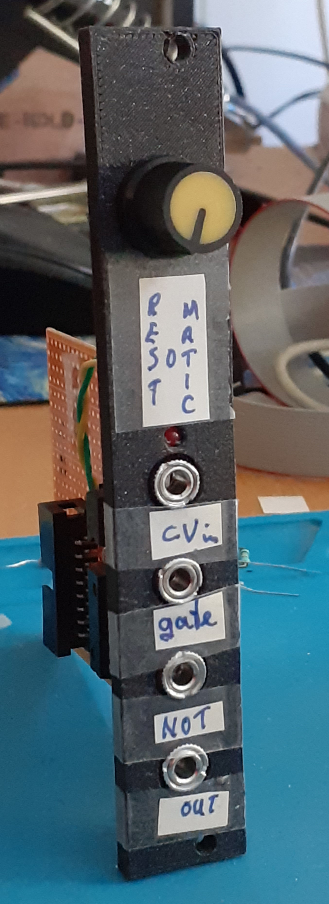
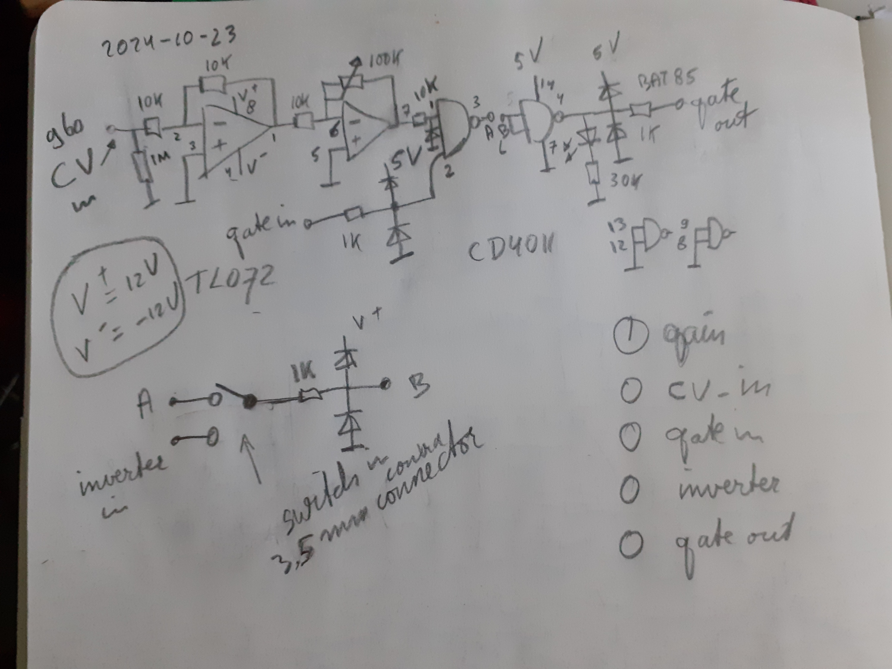

# Summary 

**Rest-O-Matic** is a utility that makes it possible to produce rests when using a B960 (or similar style) sequencer. 
The B960 sequencer outputs control voltages and gates. It will ‘play’ all steps all the time unless you skip one or 
more steps. Skipping a step however will shorten the sequence by 1 step and sometimes this is not what you want. 
So I came up with Rest-O-Matic.

**Rest-O-Matic**’s inputs are connected to the B960 CV out (connect to ‘CV-in’) and the clock the B960 uses (connect to ‘gate’). Rest-O-Matic from these two produces a gate on its output only if the CV voltage is above a certain threshold. This gate can then be used to control the VCA of the oscillator who’s frequency is controlled by the B960 CV voltage. Thus, by choosing the CV-values on a B960 you can determine whether a note is played or a rest is ‘played’.

This was just a quick project, so I did not make a PCB but used a bit of perf board and 3D-printed a front panel.

# How it works

An amplifier is used to amplify the input voltage (if needed). 
Only if the output voltage of the opamp is high enough AND there is a gate in signal will the NAND produce an output gate.
Using that gate to open a VCA of some VCO will result in a note sounding.
Setting the CV pots on a 960 can thus be used to determine whether a tone or a rest is played,

The double NAND gates are combined to be a logical AND. 
Because I sometimes need an inverter in my rack, 
I added a jack between the 1st and 2nd NAND (this is the extra bit on the left that connects 
point A to B; the switch here is the one in the jack connector). So as an aside I can also 
use this module as a single NOT / inverter port. If you do not need this, then just leave that out.
The opamp is powered with -12 and +12 Volt, the quad NAND gate with 5V. The diodes at the inputs of 
the NAND-gates make sure the output voltage of the opamp on the input of the NAND-gate does not 
exceed 5V (much).

All diodes are BAT85.

# Usage

To use Rest-O-Matic, turn up the gain from 0 until the LED starts flashing.

# Demo

There is a short demo here:

https://www.youtube.com/watch?v=nHDPp0UoPAk
