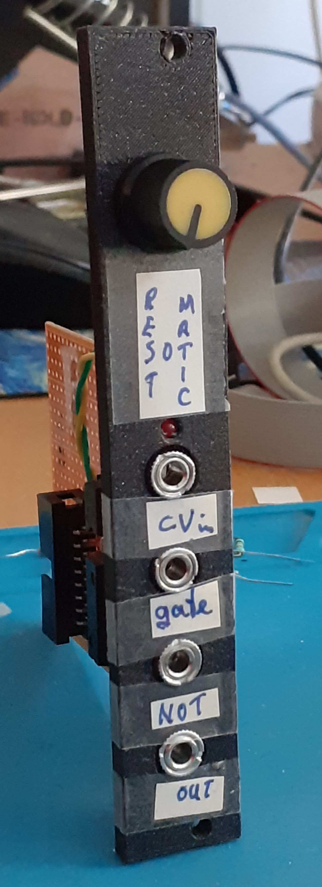

# Summary 

**Rest-O-Matic** is a utility that makes it possible to produce rests when using a B960 (or similar style) sequencer. 
The B960 sequencer outputs control voltages and gates. It will ‘play’ all steps all the time unless you skip one or 
more steps. Skipping a step however will shorten the sequence by 1 step and sometimes this is not what you want. 
So I came up with Rest-O-Matic.

**Rest-O-Matic**’s inputs are connected to the B960 CV out (connect to ‘CV-in’) and the clock the B960 uses (connect to ‘gate’). Rest-O-Matic from these two produces a gate on its output only if the CV voltage is above a certain threshold. This gate can then be used to control the VCA of the oscillator who’s frequency is controlled by the B960 CV voltage. Thus, by choosing the CV-values on a B960 you can determine whether a note is played or a rest is ‘played’.

There are 2 versions. v0.1 I made on perf board and this works well. For v0.2 at a later stage I designed some PCBs for the same circuit.
